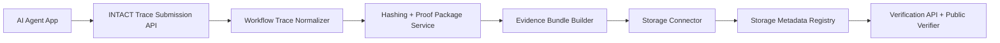

# INTO Protocol / INTACT Layer

[English README](README.md)

INTO Protocol 是一个面向 AI 生成工作完整性的 Filecoin-backed 基础设施协议。

本仓库实现 Phase 1 MVP：**INTACT Layer**。它是一个轻量的 AI Agent 工作流 trace、proof package、证据备份和公开验证层。

核心流程是：

```text
AI workflow trace -> trusted proof package -> Filecoin-backed evidence backup -> verification
```

INTACT Layer 不是 AI Agent 平台，不是聊天机器人产品，不是企业仪表盘，不是通用存储封装，也不是计费系统、Token 系统或 RWA 模块。它要解决的问题更窄，也更底层：当 AI Agent 生成一个输出时，系统能不能在之后证明“当时到底发生了什么”。

## 为什么需要这个项目

AI Agent 正在被用于生成报告、检索文档、调用工具、执行业务流程和辅助决策。但多数 AI 生成工作目前缺少可靠的 proof layer。

很多场景里，最终输出是存在的，但背后的过程并不清楚：

- 执行了什么任务？
- 哪个 AI Agent 生成了这个输出？
- 使用了什么输入、文件或数据源？
- 中间发生了哪些 workflow events？
- 最终输出是什么？
- 哪些哈希可以证明输入、输出、证据和工作流 trace 没有被篡改？
- 相关证据是否被备份到 Filecoin-backed storage？
- 之后其他系统或用户是否可以验证这个 proof？

INTO Protocol 通过为 AI 生成工作创建 tamper-evident proof records 来回答这些问题。

## 当前 MVP 包含什么

- Next.js + TypeScript 项目 scaffold
- 面向集成方的 Tenant API key 鉴权
- 数据模型：tenant、agent、task、workflow event、file reference、output record、proof package、evidence bundle、storage record、verification record
- Task 创建 API
- Workflow event 提交 API
- File reference 提交 API
- Output metadata 提交 API
- Proof package generator
- 对 inputs、outputs、files、events、workflow traces、proof packages、evidence bundles 的稳定 SHA-256 哈希
- Storage connector abstraction
- 本地开发用 mock Filecoin-backed storage connector
- Verification API
- Public verification page
- Basic proof report view
- 一个演示 AI Agent task 生成 proof package 的 seed workflow

## Phase 1 范围

本仓库只聚焦 INTACT Layer MVP：

- 标准化 AI workflow trace schema
- Trace 与 metadata submission APIs
- Trusted output proof package generation
- Filecoin-backed evidence backup abstraction
- Storage metadata recording
- Verification API
- Public verification page
- Basic proof report template
- Demo integration workflow

本阶段明确不做：

- 企业级 dashboard
- RWA evidence module
- 计费或用量系统
- Token 系统
- 完整 AI Agent framework
- Chatbot interface
- 高级权限管理
- 私有化部署系统
- 合规 SaaS 套件

## 架构



当前实现使用 `.intact-data/` 下的本地 JSON data store，因此无需先部署数据库就能跑通 MVP。核心 service layer 与 API handlers 已经分离，后续可以替换为 PostgreSQL/Prisma。

Storage layer 也做了抽象。本地开发时使用 mock Filecoin-backed connector，它会把 evidence bundle 写到本地，并返回类似 Filecoin-backed storage 的 metadata，例如 storage URI、CID、PieceCID、retrieval URL 和 retrieval status。

## 仓库结构

```text
src/app/                         Next.js App Router 页面与 API routes
src/app/api/v1/                  INTACT Layer API endpoints
src/app/verify/                  Public proof verification page
src/app/proofs/[proofId]/report  面向人的 proof report
src/lib/intact/                  核心模型、service、hashing、proof、storage、verification
src/lib/intact/storage/          Storage connector abstraction 与 mock Filecoin connector
docs/                            API 与架构说明
examples/                        Demo workflow payload
prisma/                          未来迁移 PostgreSQL 时的关系模型草案
tests/                           Hashing 与 proof flow 测试
```

## 快速开始

```bash
cp .env.example .env.local
npm install
npm run dev
```

生成一条 demo proof：

```bash
npm run seed:demo
```

脚本会输出 public verification URL：

```text
http://localhost:3000/verify/proof_...
```

以及 proof report URL：

```text
http://localhost:3000/proofs/proof_.../report
```

## API 鉴权

Tenant integration APIs 需要在下面任意一个 header 中传入 API key：

```text
Authorization: Bearer <api-key>
x-api-key: <api-key>
```

API key 会先哈希再存储。默认情况下，workflow inputs、event payloads 和 outputs 只参与哈希，不以明文持久化。未来如果接入真实证据存储，也应该优先使用加密 evidence bundle。

## 主要 API

请求示例见 [docs/API.md](docs/API.md)。

- `GET /api/v1/health`
- `GET /api/v1/schema`
- `GET /api/v1/examples`
- `POST /api/v1/tasks`
- `GET /api/v1/tasks/:taskId`
- `POST /api/v1/tasks/:taskId/events`
- `POST /api/v1/tasks/:taskId/files`
- `POST /api/v1/tasks/:taskId/output`
- `POST /api/v1/tasks/:taskId/finalize`
- `POST /api/v1/tasks/:taskId/proof`
- `GET /api/v1/proofs/:proofId`
- `GET /api/v1/proofs/:proofId/package`
- `GET /api/v1/proofs/:proofId/report`
- `POST /api/v1/proofs/:proofId/backup`
- `GET /api/v1/proofs/:proofId/storage`
- `GET /api/v1/proofs/:proofId/status`
- `POST /api/v1/verify`
- `GET /verify/:proofId`
- `GET /proofs/:proofId/report`

## Verification Result

Verification API 会返回明确状态：

- `valid`
- `invalid`
- `pending`
- `missing_storage`
- `retrieval_unavailable`
- `schema_error`

验证检查包括 proof 是否存在、schema 是否有效、proof package hash、workflow trace hash、event hashes、input/output/file hashes、storage metadata 和 retrieval status。

## 开发命令

```bash
npm run typecheck
npm test
```

在没有 package manager 的受限环境中，仓库也提供 Node 24 fallback 测试命令：

```bash
npm run test:node24
```

## 隐私原则

INTACT Layer 面向隐私敏感的 AI workflow verification 设计：

- 原始数据不必要时只存哈希
- 默认避免持久化敏感明文内容
- Evidence file upload 与 metadata submission 分离
- Raw payload storage 保持可选
- Public verification page 不暴露私有 task data
- 公开验证只证明完整性，不泄露客户或 pilot partner 数据

## North Star

MVP 成功的标准是：一个 AI application developer 可以提交一条 AI Agent workflow trace，生成 trusted proof package，通过 Filecoin-backed storage 备份证据，并分享一个可公开验证的 proof link。

INTO Protocol turns AI-generated work into verifiable proof records backed by Filecoin storage.
